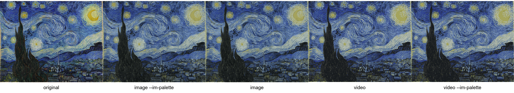
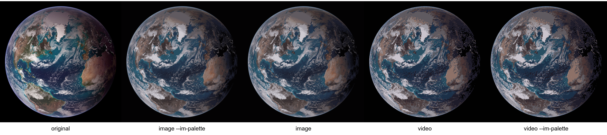
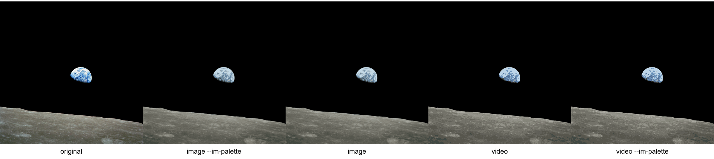
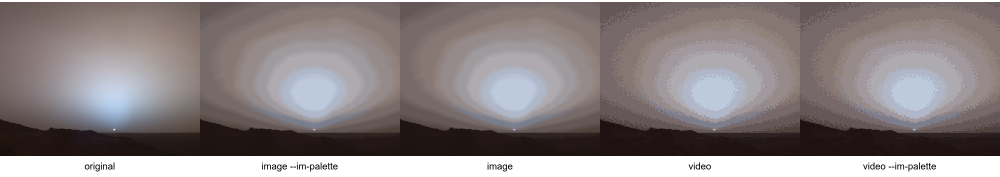
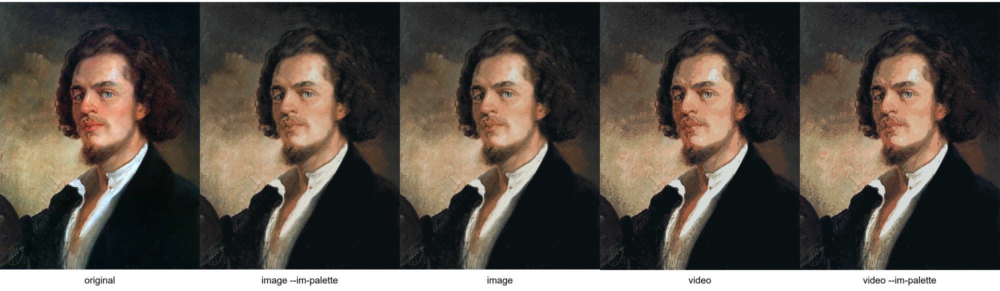

# rdither

GPU-accelerated reimplementation of ImageMagick's Riemersma error-diffusion dither,
for images and video. Bit-exact with ImageMagick where that is possible, and
deliberately approximate where it is not — [see exactly which is which](#where-bit-exactness-holds).

## The guarantee

If you point it at an image with the sequential walk and ask for 16 colours, you get
back the same 16 colours ImageMagick would have produced, the same pixels, byte for
byte - not "similar", not "close enough to pass". That is the design goal, and it is
checked against ImageMagick on every build by [Continuous
integration](.github/workflows/ci.yml), which builds a clean clone and runs the suite
on a GPU-less runner — deliberately, because that is the configuration five separate
defects survived in, each one a build path nobody had ever run.

| | coverage | notes |
|---|---|---|
| clean clone builds at all | every push | the check that would have caught all five defects |
| CPU-only build, 100 bit-exact cases vs ImageMagick | every push | 50 further cases report SKIPPED, not passed |
| CUDA build compiles and links | every push | 12.8 toolkit unpacked from redist archives; no GPU on the runner |
| OpenCL-vs-CUDA, 54 cells | manual | no GPU on the runner |
| video probes | manual | no GPU, and no clip is committed |

A skipped check is never counted as a pass, and the CPU job asserts that at least 90
real cases actually ran — because a suite that skips nearly everything and exits 0 is
worse than a failing one.

Both jobs are green on every push. Getting there took three fixes in the CUDA job
alone, and every one of them was in code I had written minutes earlier and never run:
the toolkit search looked one level deep when the archive nests three, the component
archives were never merged into the single root `find_package(CUDAToolkit)` needs, and
`build.cmd` ignored `CUDA_PATH` entirely. The third one had a fault inside the fix —
`%VAR%` inside a parenthesised batch block expands before the block runs, so the test
always saw an empty variable. That is why the workflow's own header now says to test
toolchain code locally before pushing it.

**The toolchain took some finding.** GitHub's hosted Windows runners ship ImageMagick
7.1.2-25 Q16-HDRI — the right variant, at the path `build.cmd` looks in first — but
**runtime only**: no `include\MagickCore\MagickCore.h`, no `lib\CORE_RL_MagickCore_.lib`,
so nothing can link against it. Five ways of installing a buildable copy were tried and
measured on a runner, and all five are recorded in
[the workflow](.github/workflows/ci.yml) so nobody repeats them. The installer in
particular is *not* drivable unattended: under `/S` it opens a directory prompt and
waits for a human, and one attempt to reproduce that locally "passed" only because this
machine already had ImageMagick installed.

What works is conda, which has no installer to prompt with:

```
pwsh -File tools/install-imagemagick.ps1
```

Twenty-one seconds, and it produces the same pinned version — 7.1.2-31 Q16-HDRI, 1,459
headers, MSVC import libraries. The script does not trust that `exit 0` means usable: it
asserts every file the build needs is present and then *reads back* the version it
actually got, because a prefix that installs cleanly can still be unbuildable.

That support is why `CMakeLists.txt` and `build.cmd` now accept **two** ImageMagick
layouts — the official Windows one, and a conda prefix, which puts headers under
`Library\include\ImageMagick-7`, names its libraries `MagickCore-7.Q16HDRI.dll.lib`, and
keeps 224 versioned DLLs in `Library\bin` rather than one beside the executable.

```
rdither --colors 16 photo.png out.png
```

**That guarantee is narrower than it sounds, and the rest of this file is where it
gets precise.** The fast GPU engines and the video pipeline are *not* bit-exact with
ImageMagick, by construction. See [Where bit-exactness holds](#where-bit-exactness-holds)
before you judge any output.

Decode, dither and encode all run at once, at about 51 fps on a 2014-era 6-core Xeon
with a GTX 1650 SUPER. So 5 minutes of **60 fps** footage took 5 minutes 53 seconds —
about 1.17x its own duration, while 30 fps footage would come out faster than real
time. What that number does *not* measure is the GPU —
[two thirds of it is decode and encode](#what-the-fps-number-means-in-practice), so a
faster CPU, RAM or disk makes it faster with the same GPU.

> ### Made by an AI — "Space Bunny"
>
> This repository was written by an AI assistant operating under the name **Space
> Bunny**, working with the project owner. There is no human author on the commits.
>
> What that means for you, stated plainly rather than buried:
>
> - **The measurements are real.** Every number in this README and in `docs/DESIGN.md`
>   came from running the code on the machine it was written on. None of it is
>   estimated or illustrative.
> - **The verification is real too, and it is the point.** 135 bit-exact cases against
>   ImageMagick, a 54-cell cross-engine bit-exactness sweep, a run-to-run determinism
>   probe, and a video frame-accounting check. See [Correctness](#correctness).
> - **Expect some things to be wrong.** An AI will confidently report work as finished
>   before the check that would prove it has run. That happened repeatedly during
>   development — including a video bug that was reported fixed twice while a second,
>   unrelated fault was still present. The commits and the issue history are the
>   record; treat anything surprising as a bug report rather than a question of
>   intent.
>
> You are welcome to use it, audit it, or throw it away. If you find a fault, the
> useful thing to say is *what you measured*, not *what you expected*.

## Licence

**GPL-3.0-or-later.** Full text in [LICENSE](LICENSE), verbatim as published by the
Free Software Foundation.

    Copyright (c) 2026 Gittanley, prompt operator
    SPDX-License-Identifier: GPL-3.0-or-later

All source code here was written by an AI assistant operating under the name
**"Space Bunny"**, directed by the prompt operator — see the note at the top of this
file, and the SPDX identifier in the header of every source file. The copyright is the
prompt operator's because a purely AI-generated work has no copyright owner in most
jurisdictions, and the human here supplied the goals, the bug diagnoses, the rejected
approaches and the decisions about what ships. `LICENSE` itself is kept exactly as
gnu.org publishes it, unaltered, because that is the form licence-detection tooling
expects.

You may use, study, modify and redistribute this freely, and **anything you build on
it must also be free and open source** — that is what copyleft means here, and it is
the part most worth having. There is no fee, no registration, and no requirement that
you credit me.

Two things it deliberately does *not* do, because a licence that did would not be open
source:

- **It does not stop you using the finished tool commercially.** If you need to forbid
  that, you need a proprietary licence, and you lose the open-source status. The GPL
  trades that off on purpose.
- **It does not stop proprietary *tools* from touching the code.** Compiling it with
  NVIDIA's CUDA toolkit, or linking against ImageMagick, does not make your build a
  derivative. Only redistributing the result would.

The patent grant in GPL-3.0 is why I chose it over GPL-2.0: you cannot be sued for
using this.

---

## Why it exists

ImageMagick's Riemersma dither is slow enough that using it on a long video is not
practical. Reimplementing it naively is also a trap: the algorithm is *not* what makes
it slow, the palette lookup is, and the obvious ways to speed that up change the output.
Almost every optimisation attempted here either made no difference or quietly changed
the image. The ones that worked are in [docs/DESIGN.md](docs/DESIGN.md), and so is the
list of ones that did not, which is the more useful half.

The result is a program that is fast because of what was measured rather than what was
assumed, and that tells you when it is guessing.

---

## Install

You need three things:

| | |
|---|---|
| **Visual Studio 2022** | any edition, with the "Desktop development with C++" workload |
| **CUDA Toolkit** | 12.x or 13.x, plus an NVIDIA driver. Only for the GPU engines |
| **ImageMagick 7 Q16-HDRI** | the **MSVC** build (`...-dll.exe` or `-static.exe`) |

Then:

```
build.cmd
```

The script checks all three before compiling and tells you exactly which one is missing
and where to get it. It finishes by dithering a test image and comparing against
ImageMagick, so a green run means the build is correct, not merely that it compiled.

Useful options:

```
build.cmd --no-cuda     CPU only.  Same program, much faster to compile
build.cmd --clean        delete the build directory and start over
```

If ImageMagick is installed somewhere unusual:

```
set IMAGEMAGICK_ROOT=C:\path\to\ImageMagick-7.x.x-Q16-HDRI
build.cmd
```

### MinGW and clang will not work

nvcc on Windows accepts only MSVC as its host compiler, and the ImageMagick import
libraries are MSVC-ABI. g++ mangles the `Magick::` symbols with the Itanium ABI and every
reference comes back undefined. This is a toolchain constraint, not a preference.

---

## Use

### What the output looks like

Five public-domain images. Every panel is 16 colours and every one is verified
bit-exact against ImageMagick. Click any strip for the full-resolution version.

[](docs/examples/starry-strip.png)

[](docs/examples/bluemarble-strip.png)

[](docs/examples/earthrise-strip.png)

[](docs/examples/mars-strip.png)

[](docs/examples/portrait-strip.png)

**Reading the five panels, left to right.**

| panel | what it is |
|---|---|
| **original** | the source image, untouched |
| **image `--im-palette`** | image path, palette built by ImageMagick's own sampling |
| **image** | image path, palette built by rdither's octree |
| **video** | one frame of a dithered clip, via `--video-lossless` |
| **video `--im-palette`** | the same clip, palette from ImageMagick's sampling |

Two things in that table are measured facts rather than intentions.

**Panels 2 and 3 are identical** — AE = 0, same colour count, same bytes. On the image
path `--im-palette` changes nothing, because there is only one frame to sample and
rdither's octree already reproduces ImageMagick's choice. It is not ignored:
`colormap: tree matches ImageMagick exactly` is printed on every run. The flag only has an
effect on video, where there are many frames to choose a palette from — panels 4 and 5
differ by a measured AE of 1.12.

**The video panels hold exactly 16 colours; the image panels do not.** A frame written
through ffv1 keeps the palette precisely, so a 16-colour request really is 16 colours. An
image is written as 8-bit RGB, which retains the dither's local variation and gives
~93,000 distinct pixel values. Neither is wrong; they answer different questions — how
many colours the dither chose, versus what is stored in this file.

You will notice the pattern where it is *supposed* to appear: **Starry Night's sky**
and the **Blue Marble's ocean** are broad smooth ramps, which is exactly where
Riemersma's error diffusion shows its structure. Flat regions stay flat. That is the
whole reason a dither exists — to make a 16-colour image look like a gradient instead of
like 16 bands.

Sources and licences in [docs/examples/SOURCES.md](docs/examples/SOURCES.md).
Sources and licences for all five images are in
[docs/examples/SOURCES.md](docs/examples/SOURCES.md).
### Images

```
rdither --colors 16 photo.png out.png

# check the result against ImageMagick instead of trusting it
rdither --colors 16 --verify photo.png out.png

# GPU.  'blocks' is the one to use: same output, far faster
rdither --colors 16 --engine blocks photo.png out.png
```

On a machine with no CUDA — an AMD or Intel GPU — use `opencl` instead. It is the
same block partition and the same arithmetic reached through OpenCL, so the output
is identical to `blocks` on the same frame:

```
rdither --colors 16 --engine opencl photo.png out.png
```

**That identity is measured, not asserted: 54 of 54 comparison cells are
bit-identical to CUDA** — four images × colour counts × three block sizes, via
`tools\probe-opencl-exact.ps1`. It is also the only path for a non-NVIDIA GPU, and
it now works from a clean clone: download the 1.1 MB Khronos SDK, unpack it beside
this repository, and `build.cmd` enables the engine. No install step and nothing
to deploy — `OpenCL.dll` is already on Windows. Full instructions in
[CONTRIBUTING.md](CONTRIBUTING.md#the-opencl-engine).

**What is not measured:** Intel and AMD hardware. All of the above was measured on
an NVIDIA driver, and the thing that varies most between vendors is FP64
throughput, which is this algorithm's cost centre. So the software is ready and
the *speed* on your GPU is not a claim anyone can make for you yet —
`tools\probe-opencl.exe` prints your device and whether it has
`cl_khr_fp64`, and [docs/OPENCL.md](docs/OPENCL.md) explains what to do with that.

It runs **video** as well as images, on the same input modes, and is within about
**1.2–1.3×** of CUDA's wall clock on 1080p60 — measured, 3 interleaved runs of 600
frames. It was long documented as "2.7× slower than CUDA", which was an artefact of
comparing the two engines on *different data paths*: OpenCL could only take rgba64le
at 8 bytes per pixel while CUDA defaults to planar yuv444p at 3, and the 2.67× of extra
traffic was the entire apparent gap. On the same path the engines were within 8% even
before the planar kernels were ported. Only `--input-mode yuv420` and the
`yuv444-prepass` are still refused, with a message. See
[docs/OPENCL.md](docs/OPENCL.md), which is also where the verification is described.

### Video

```
rdither --video --engine blocks --colors 16 in.mp4 out.mkv
```

Decode, dither and encode run concurrently, so the reported fps is the whole pipeline's
throughput rather than one stage's. Audio from the source is carried across untouched
(`--no-audio` to drop it).

### What it reads, what it does to the pixels, what it writes

Not only a dither: the video path also does its own colour conversion, in both
directions, on the device.

**Input.** Anything ffmpeg decodes, at the pixel formats ffmpeg produces. The decoder
hands over planar YUV, and `--input-mode` chooses what happens next:

| `--input-mode` | bytes/px | what it does |
|---|---|---|
| `yuv444` (default) | 3 | swscale's own YCbCr→RGB matrix, on the device |
| `yuv444-prepass` | 3 | same result via a coalesced pass; measured **AE 0** against `yuv444` |
| `yuv420` | 1.5 | the decoder's own format, no swscale at all; chroma reconstructed 2× bilinear on the device |
| `rgba64` | 8 | the reference path: ffmpeg converts, rdither receives RGBA |

`yuv420` is the cheapest and `rgba64` the most faithful, and on 4:2:0 source that
difference is large. Measured on a 4:2:0 clip, comparing modes to each other so the
dithering is held constant:

| | vs `yuv444` | vs `rgba64` |
|---|---|---|
| `yuv444` | — | 28.0 dB |
| `yuv420` | **5.8 dB** | 5.8 dB |

**5.8 dB is not a colourimetric nuance, it is a different picture.** If you have 4:2:0
footage and care about fidelity, use `yuv444` or `rgba64`. On a true 4:4:4 source every
mode agrees exactly (`yuv444` vs `rgba64` is AE 0), so the choice only bites for 4:2:0
input — which is most real footage.

**Output.** `--video-pix-fmt` defaults to `yuv444p` and that default is load-bearing:
`yuv420p` output subsamples chroma over 2×2 blocks, averaging away the dither pattern
entirely. It is also far smaller — 15,191 bytes against 36,031 for the same 600 frames
— so the small file is the one where the dither is gone. `--video-lossless` gives
ffv1 yuv444p, which keeps the palette exactly, at roughly 28× the bitrate of yuv420p
H.264.

### Concurrency, and the RAM it uses

Decode, dither and encode all run at once, and the tool will use the machine you give
it. On the benchmark machine, thread-time totals 647 s against a 352 s wall, so every
core is busy — and roughly two thirds of that is decode and encode rather than GPU
work. The GPU is not usually the constraint; see
[what the fps number means](#what-the-fps-number-means-in-practice).

**`--cpu-threads` is not a scheduling knob, and this is the part worth reading.** With
`auto` and a GPU present, the host worker pool is **off** (`0`), and the GPU walk is the
only walk. That is measured, not incidental: the host block walk costs ~937 ms/frame at
1080p against the GPU's 63.5, and on a deep queue ten host workers make the whole
pipeline *slower* (219–244 ms/frame with them, 115 without) because they saturate the
memory bandwidth the GPU's data path needs.

So **any explicit value ≥ 1 turns the host walk on**, and the host walk is not
bit-identical to the GPU walk — the program says so on every run that does it:

```
[video] note: the 10 host worker(s) use the host block walk, which is NOT bit-identical to ...
```

Consequences, all measured on a 2-second clip with the palette pinned:

| | what runs | vs `auto` |
|---|---|---|
| `auto`, GPU present | GPU walk only | — |
| `--cpu-threads 2` | host walk | **AE 0** with `--no-gpu` auto |
| `--cpu-threads 1` | host walk, one worker's partition | differs |

Even among host-only runs the count matters: fewer workers means a different block
partition, and each block restarts its error queue, so `--cpu-threads 1` and `auto`
differ by about 4,200 pixels. **If you need reproducible output, leave it on `auto`.**

Other knobs, briefly: `--reader-threads`, `--decode-threads` and `--encode-threads`
cap ffmpeg's own threads; `--gpu-workers N` runs N GPU walks at once (2 measured no
faster, the dither being saturated rather than stalled); `--frames`, `--batch-frames`
and `--queue-depth` set the work granularity.

**RAM.** The queue is sized first and the worker count trimmed to fit it, because a
deep queue with fewer workers beats a shallow one with more. `[ram]` on every run
reports the real figure — 42 slots + a 782 MiB reserve ≈ 824 MiB peak at 1080p, with
the reserve dominating. `--mem-fraction` sets the share of physical RAM the queue may
use (default about a third) and `--max-ram-mb` caps it absolutely; frames beyond the
budget spill to disk rather than failing.

### What the fps number means in practice

The measurement below is on a real clip, not a synthetic one:

```
rdither --video --engine blocks --colors 16 input.mp4 out.mkv
```

`input.mp4` is 18001 frames, 1920x1080, 60 fps, 300.032 s — h264 yuv420p, bt709,
tv range, 10.2 Mbps, 373 MB, with stereo AAC. Machine: **Xeon E5-2620 v3 @ 2.40 GHz**,
6 physical cores / 12 threads, 15.8 GB RAM, **GTX 1650 SUPER**. Input mode, pixel format,
preset, queue depth, workers and batch size were all left at their defaults.

```
palette    : 16 colours from 256 sampled frame(s), 128x128 montage, 64.0 MiB, 28676.7 ms, mean saturation 22.1%, 9 near-neutral
frames     : 18001 in 352.51 s (51.1 fps)
busy time  : palette 28677 | decode 270944 | dither 222857 | encode 153089 | wall 352507 ms
```

**Read that as elapsed time, not as a benchmark.** 18000 frames at 60 fps is 5 minutes
of footage, and it finished in 352 seconds. So:

> **5 minutes of 60 fps video takes about 5 minutes 53 seconds to render.** You wait
> roughly six minutes, and the file is complete, seekable and openable in an editor
> when the command returns. Nothing is queued up behind it.

The same ratio holds wherever you point it — roughly **1.17x the footage's own
duration**. That means:

- **60 fps footage takes about 17% longer than it plays.** A 3-hour 60 fps clip is
  about 3 hours 31 minutes. A 30-second insert takes 35 seconds.
- **30 fps footage comes out well ahead of real time** — 30 frames per second of
  footage against a ~51 fps pipeline, so roughly **0.59x**, and a 3-hour 30 fps clip
  lands in about 1 hour 46 minutes. Same machine, same numbers, opposite conclusion.

So whether this is faster or slower than real time depends entirely on your source
frame rate, and it is worth checking rather than assuming.

#### This clip is not a real-world benchmark, and here is the measurement that says so

Do not quote the 51 fps at anyone. That clip is a **DaVinci Resolve render using the
YouTube 1080p preset** — a low-bitrate, already-compressed, heavily re-encoded file —
and the content is a **grey, low-saturation extreme hyperlapse at 2000% speed**, so
almost nothing in it resembles real footage. It is the longest clip this project was
measured on, and it is unrepresentative in ways the tool can partly quantify.

The palette line is the tell: **mean saturation 22.1%, and 9 of the 16 palette entries
near-neutral.** Nine greys in a 16-colour palette is not what most video looks like. A
palette sampled from saturated, colourful material would spend that budget on hues
instead, and hue transitions are more expensive to encode than flat greys — so the
encode half of this measurement is flattered by the content in a way yours would not be.

What survives the criticism is the part that is not merely a property of this one
clip — with one important qualification, which is worth stating rather than glossing:

#### The dither cost depends on the palette, not on the pixels

The walk kernel has no data-dependent branch and no early exit: given a palette, every
pixel of every frame costs the same — a fixed 16-deep error-queue shift plus a palette
search. So the *pixel values* cannot change the dither's cost. Measured here:

| | |
|---|---|
| per frame, 1920x1080, 16 colours, B=512 | **~10 ms** |
| pixels dithered | 2,073,600 x 18,001 = **37.3 gigapixel** |
| implied rate | ~207 Mpixel/s, **100 fps of dithering** |
| against 60 fps footage | **1.7x real time, on its own** |

**But the palette is built from your frames, and its shape changes the search.** A
palette of 16 entries where most are near-neutral greys is very lopsided, and a lopsided
tree makes each lookup descend further. Measured on this project at identical geometry
and identical tree *size*: **387 ms** on the grey clip against **166-181 ms** on
`tests/L605.mp4`, with nodes-visited-per-pixel at **3.71 against 2.63** — a 2.2×
difference caused entirely by what the sampler picked. See
[docs/DESIGN.md](docs/DESIGN.md) §12.

So do not carry the 10 ms/frame figure to your own footage as a promise. It is a number
*for this palette* — 9 of 16 entries near-neutral, mean saturation 22.1% — and a
saturated, evenly-spread palette will search less deep. It could be faster or slower.
The honest summary is that the dither is the stage a GPU accelerates, and on this
machine with this palette it is not the bottleneck; how much of the wall it takes on
your content is measurable from the same `busy time` line.

#### Which is why the machine matters more than the GPU

The `busy time` line is *thread*-time summed across all six cores, so the stages total
647 s against a 352 s wall and you cannot divide them to get each stage's share of it.
As a rough split of that thread-time, though, decode is 271 s, dither 223 s, encode
153 s — **two thirds of the work is not GPU work at all.**

So the same GPU on a better machine finishes faster without the dither doing a single
extra FLOP. Decode and encode are bound by memory bandwidth, storage throughput and
single-thread CPU — and this machine has a **2014-era server Xeon at 2.4 GHz**, which
is very likely the single biggest thing making it slow. A machine with the identical
GPU but a modern CPU, NVMe storage and more memory bandwidth will render this
materially faster. The converse also holds: if you are already faster than real time,
a better GPU will not meaningfully change your edit session. Look at which stage is
largest for your content before spending money on a GPU.

**On a segment you can work before the whole thing lands:** `--segment-frames N` writes
separate muxed segment files as it goes, so for a long job the early ones are already
on disk and playable while the later ones render. The default single-file mode writes
one complete file on return; if you interrupt it, that file holds the frames completed
so far and `--resume` continues from there.

The reported wall **includes the palette stage** — 28.7 s of it here, about 8%. It did
not for a while: the denominator was measured from inside the pipeline, which starts
after the palette is already built, so two runs whose palettes differed by 25 s
reported the same fps. If a number here looks worse than one you remember, this is why.

### Rotated video

A stream with a 90 or 270 degree display matrix — every portrait phone video — used to
come out **sheared**. The picture was correct but sliced as if it were the wrong width,
and the output had no rotation tag to compensate.

The cause was silent. ffmpeg's rawvideo output auto-rotates by default, so the decoder
handed the pipeline 1080x1920 frames, while rdither sized every buffer from `width` and
`height` in the stream header, which are the **coded** 1920x1080. The pixel *count* is
identical either way, so no bounds check could detect it — only the row width was
wrong, and the frame was read back sliced differently.

rdither now uses the **displayed** geometry everywhere: buffers, the raw pipe's `-s`,
the encoder, and all three dither engines. The output carries upright pixels and no
rotation tag, so it is correct in any container. It says so when it happens:

```
[video] source carries a -90 degree display matrix; the decoder rotates, so the
frames are processed and written as 1080x1920 upright with no rotation tag.
```

Rotating the pixels in, rather than copying the display matrix to the output, is forced
rather than preferred: ffmpeg 9 exposes `-display_rotation` as an **input** option only
and has removed `-metadata:s:v rotate=`, so there is no way to carry the matrix to a
re-encoded output. The cost is that the error diffusion runs on upright pixels, so its
direction is rotated relative to ImageMagick's own pipeline — that changes which pixels
differ, not whether the result is a correct 16-colour dither.

**There is no regression test for this.** Every clip in `tests/` is unrotated, and
ffmpeg cannot *write* a display matrix at all, so a fixture cannot be generated the
obvious way. It is the one known gap in the suite, and the reason to suspect rotation
first when a rendered video looks wrong.

### Variable frame rate

A VFR source used to render at the wrong length. Three separate faults, all of which
present as "doesn't render correctly":

**The rate.** The encoder was fed `r_frame_rate`, which for a variable-rate source is
the *maximum instantaneous* rate, not an average — a container hint, not a summary. A
3.03 s source came out 1.63 s long, with matching A/V desync. rdither now measures the
real frame timings and re-emits at the true average. Constant-rate inputs are
unaffected: the two numbers are identical.

**`-shortest`.** That flag stops output at the shorter of the two streams, which is
right when the audio runs long and actively wrong the other way: when the **video** is
longer, it *deletes video frames* to make the tracks match. On a 30 s excerpt with 895
frames against 30.0128 s of audio, the output had 892 — three frames gone, every run,
scaling with the clip. It is now used only where it trims audio, decided by comparing
the measured durations.

**Per-frame cadence is still flattened.** The output is constant rate at the true
average, which fixes duration and A/V sync but resamples the motion once. Restoring
the cadence needs a piecewise `setpts` re-applied at the encoder, because a rawvideo
pipe carries no timestamps. `--video-preserve-vfr` does this and is **off by default**:
the mechanism is proven in isolation, but it is not verified end to end, because no
genuinely variable-timestamp fixture could be produced on this machine.

rdither reports what it did, because a flattened VFR render is frame-for-frame
indistinguishable from a correct one and nothing in the output says which you got:

```
[video] variable frame rate: 5128 frames in 322 constant-rate runs, 172.0645 s
total, 29.803 fps average (the container declares 29.833333333).
[video]   re-emitted at the true average, 29.803 fps.  Duration and A/V sync match
the source; per-frame motion cadence is flattened.
```

## Where bit-exactness holds

This is the most important section in the file, because "bit-exact" is true of some
engines here and false of others, and the difference is not a detail.

| What you run | Engine it uses | vs ImageMagick | Tested by |
|---|---|---|---|
| `--engine cpu` | sequential walk, on the CPU | **bit-exact** | 135 cases, `verify.ps1` |
| `--engine cuda` | sequential walk, on the GPU | **bit-exact** | 135 cases, `verify.ps1` |
| `--engine blocks` | block-parallel walk, CUDA | **not exact** — 1.7% of pixels differ | determinism only |
| `--engine opencl` | block-parallel walk, OpenCL | **not exact** — 1.7% too, being identical to `blocks` | `blocks` on 54 cells + determinism |
| `--engine approx` | iterative solver | **not exact**, by design | not covered |
| `--video` (any engine) | block-parallel, always | **not exact** | frame accounting, cross-engine |
| `--dither bayer\|atkinson\|jarvis\|floyd-steinberg\|clustered-dot` | their own kernels | **not exact**, and not trying to be | determinism only |
| `--dither bayer-ordered\|void-and-cluster` | ordered thresholds, no diffusion | **not exact**, and not trying to be | determinism only |

**So: images on `cpu` or `cuda` are bit-exact. GPU *block* engines and all of video
are not.** One design decision causes that, and it is not a bug:

**The block walk is an approximation, on purpose.** Riemersma diffusion is a strictly
sequential walk: one 16-entry error queue, one cursor, each step consuming the last
step's residual. To parallelise it, a block of N positions restarts its queue from
zero, so only the first 16 positions of each block can be perturbed. That is a bounded,
*localised* defect — a slightly different speckle at block seams, not banding and not
drift — and it is measured against ImageMagick on a 200x150 gradient:

| `--blocks` | pixels differing from ImageMagick | RMSE |
|---|---|---|
| 32 | 1819 of 30001 (6.1%) | 0.0239 |
| **512** (default) | **501 of 30001 (1.7%)** | **0.0107** |

Larger blocks carry error further before restarting, so they land nearer the reference.
512 is the default because it is the faithful one: `--blocks 32` is 11% quicker on the
dither but carries 3.4× the deviation (RMSE 0.0239 against 0.0107). Since the dither is
roughly a third to a half of the pipeline depending on content, that 11% is a few
percent end to end — which is a deliberate trade, and `--blocks 32` is there if you
want the other end of it. **No block size makes the walk exact — only cutting it does.**

**Video always uses the block walk.** The pipeline is built around the block partition:
each work item is a batch of frames dithered as independent blocks, which is what gives
it its parallelism. A sequential walk cannot be batched, so the video path is the
approximation by necessity, and that is the honest answer to "is video bit-exact?" —
**no**.

There is no bit-exact video mode, and `--no-gpu` is not one. `--no-gpu` runs the *same*
block walk on host workers, so on paper it is the way to check the GPU is not lying to
you without a second GPU. **On video it currently is not, because it has real bugs.**

One is fixed: the host path was writing rgba64le into a pipe declared as planar 4:4:4,
so the encoder read the wrong bytes and a red band came out green. `--no-gpu` and CUDA
are now **AE 0** against each other on the `rgba64le` path.

Two are open. The `yuv444` input mode is still misread on the host (16-bit elements
read from an 8-bit planar buffer), and the host pipeline does not reproduce run to
run — two runs of the identical command still differ, at `--cpu-threads 1` as well, so
it is not a race. The same engine on a single *image* is bit-exact against CUDA, so all
of this is the video plumbing rather than the block walk. Measurements are in the
comment at the top of `tools/probe-video-determinism.ps1`; look there before trusting
`--no-gpu` on video. **Treat it as CUDA-only until that test passes.**

If per-pixel agreement with ImageMagick matters more than throughput, the dither has to
be cut rather than parallelised, and that is an architectural change to the video
pipeline — not a flag. It is not built.

**And video is not bit-exact with its own input either**, which is a separate point
worth making plainly. Beyond the dither, the default encoder is lossy `libx264`, and
`--video-pix-fmt yuv420p` subsamples chroma over 2×2 blocks, averaging away the dither
itself. Measured on 1080p at 16 colours: `ffv1 yuv444p` → 56 unique colours in the
output, `libx264 yuv444p crf 12` → 15191, `libx264 yuv420p` → 36031. Use
`--video-lossless` when you care what the encoder did to the palette; it costs about
28× the bitrate.

**What *is* verified for the GPU engines**: that `blocks` and `opencl` agree with each
other byte-for-byte, per pixel, on 54 cases including alpha input, and on 60 frames of
1080p video — and that both are deterministic across repeated runs. The OpenCL port
was built against that bar specifically, because `rd_riemersma.h` defines the two
engines as having the same partition and the same arithmetic, which makes "identical or
wrong" the only available outcome. Neither claim is that they match ImageMagick.

### Progress and ETA

Long stages report themselves, with an ETA:

```
[palette] 128/256  50%  9.1/s  eta 14s  14.0s elapsed
[video] 7984/18001  44%  48.7/s  eta 3m47s  2m44s elapsed  read 8000
```

On a terminal the line is redrawn in place, about four times a second. Redirected to
a file it becomes one newline-terminated line every ten seconds, because a log file
full of carriage returns is not a log file. `--quiet` prints none of it.

`[video]` counts frames **written to the output**, and `read` is how far the decoder
has got. The gap between them is the depth of the in-flight queue; a `read` that
climbs while the bar does not means the bottleneck is downstream, not in decoding.
While the bar is drawing, the per-batch timing lines are suppressed, since they
would land on the bar's own line — `RD_TRACE=1` brings them back.

### Interrupting and resuming

A long render can be split, and a run that dies mid-way does not have to start over:

```
rdither --video --engine blocks --colors 16 --segment-frames 2000 in.mp4 out.mkv
rdither --video --engine blocks --colors 16 --resume out.mkv
```

Each segment is verified on resume, so a truncated output is reported rather than
accepted.

### All the options

```
rdither --help
```

---

## Two things worth knowing before you judge the output

**The encoder can throw the palette away.** A 16-colour image re-encoded as lossy 4:2:0
does not have 16 colours any more — chroma subsampling averages the dither's per-pixel
alternation away, and lossy compression invents colours around every transition. Measured
on this pipeline: 16 colours in, 36356 out at `yuv420p`, 30445 at `libx264 yuv444p crf 18`,
56 at `ffv1 yuv444p`. If the result looks flat and grey, this is usually why, and the fix
is `--video-lossless` (about 28× the bitrate) or accepting some loss. rdither warns you
when the chosen settings cannot carry the palette.

**The palette comes from sampling, so it can miss.** For video it samples frames across
the whole clip — as many as a 60-second budget allows, up to 256 — and reports the mean
saturation it got. That number is the thing to check. If it comes back low, the footage
really is grey, and more samples will not fix it: on grey-heavy material saturation sits
at 22–24% whether you sample 30 frames or 256.

---

## Extending it

rdither reproduces one algorithm exactly, but almost nothing around it is specific to
Riemersma. The palette builder, the curve generator, the block partitioner, the
concurrent pipeline and the crash-resume checkpoints all work with any dither you supply.

Add one with `--dither`:

```
rdither --list-dithers                      # what is registered
rdither --dither bayer --colors 16 in.png out.png
```

`examples/bayer_dither.cc` is a complete, working second algorithm in about 40 lines,
built into the default binary. It exists to prove the seam works rather than to be useful
— ordered dithering has visible 8×8 texture where Riemersma has none, and its threshold
is applied as a brightness offset that is a no-op at this bit depth. For a dither you
would actually choose:

| `--dither` | what it is |
|---|---|
| `bayer-ordered` | 8×8 Bayer, no error diffusion. Crisp; the 8×8 period is visible by design. |
| `void-and-cluster` | blue-noise thresholds, 64×64 matrix. Intended for smooth gradients, where Riemersma's worms are objectionable. |
| `void-and-cluster-fast` | the same algorithm at 32×32, for when the matrix build is too slow. |

"Blue noise" and "void-and-cluster" are the same algorithm — Ulichney's — so there is no
separate `blue-noise` name; the two entries are two tile sizes of one method.

`--diffusion` scales the threshold toward 0.5, and `--diffusion 0` reduces any of them to
plain nearest-colour — the same meaning it has for the diffusion kernels.

**None of this is bit-exact with anything, and none of it is trying to be.** They are
dither *choices*. See [Where bit-exactness holds](#where-bit-exactness-holds).

**Verified:** each emits exactly the palette's colours with no off-palette rounding, and
each is deterministic across repeated runs (`probe-determinism.ps1` sweeps 8 algorithms
over 4 runs each).

**Not verified:** that the void-and-cluster spectrum is actually blue. A fixture that
exposes the raw threshold matrix is still missing — with a 2-colour palette the two
distances are equal exactly at the midpoint, so the pattern cannot appear at all — and
the 64×64 and 32×32 outputs differ by only ~32 pixels in half a million, which is less
than a tile-size change should produce and is not yet explained. The filters are sound
and distinct; the quality claim is not yet earned.

Writing your own is three steps: copy that file, write the kernel, add it to
`RD_SOURCES` in `CMakeLists.txt`. [include/rd_plugin.h](include/rd_plugin.h) has the
interface and, more usefully, the two mistakes that cost real time to diagnose.

Registration is at compile time, not runtime loading, on purpose. A `LoadLibrary` plugin
built with a different toolchain has to agree with the host on struct layout, calling
convention and allocator, and this program is built with a specific MSVC + CUDA against a
specific ImageMagick. Same-binary means the same compiler, the same headers, and none of
that class of problem.

---

## Layout

```
include/          headers; rd_plugin.h is the extension interface
src/              the implementation
examples/         bayer_dither.cc -- a worked example of a plugin
tools/            measurement scripts (the record of how the numbers were got)
docs/DESIGN.md    the full engineering record
docs/OPENCL.md    the OpenCL engine: what it is, how it is verified, what is left
verify.ps1        135 bit-exact cases against ImageMagick
build.cmd         build, with dependency checks
```

`rd_cuda_common.cuh` and `rd_riemersma.h` are the two files where the actual algorithm
lives. They are commented at the level of "why this and not the obvious thing", because
every one of those choices is load-bearing for bit-exactness.

---

## Correctness

`verify.ps1` renders 135 cases and compares each against ImageMagick's own output, pixel
by pixel, with zero tolerance. It is the first thing to run when something looks wrong
and the last thing to run before committing.

```
> powershell -File verify.ps1
bit-exact cases: 135 passed, 0 failed
```

**Read that number for what it is.** Those 135 cases run on `cpu`, `cuda` and
`cpu --max-ram-mb 1` — the *sequential* walk, the one that is supposed to be exact. The
suite is the reason the exactness claim is trustworthy, and it is also the reason the
inexactness claims are not in any way tentative: those come from a separate measurement
against ImageMagick's output, not from this suite, because this suite does not touch
those engines at all. See [Where bit-exactness holds](#where-bit-exactness-holds).

Beyond that suite, `verify.ps1` also runs:

| Check | What it proves | Result |
|---|---|---|
| `tools\probe-determinism.ps1` | repeated runs give identical pixels and identical files | 6/6 |
| `tools\probe-opencl-exact.ps1` | OpenCL == CUDA, per pixel, on 54 image cells | 54/54 |
| `tools\probe-video-exact.ps1` | OpenCL == CUDA on 60 frames of 1080p, **both data paths**, and no frames lost | 2/2 identical |
| `tools\probe-video-determinism.ps1` | the same video command 8× over is the same pixels and the same frame count | 2/2, **1 known defect** |
| `tools\probe-unvisited-pixel.ps1` | the pixel the walk never visits keeps its source value, on 9 geometries | 9/9 |

That last one is the odd one out and earns its place. The other three all compare
two engines against each other, which makes them **structurally blind to a bug both
engines share** — and that is not hypothetical. ImageMagick's Riemersma walk skips one
in-bounds cell for some geometries; the GPU scatters write only visited pixels; and the
uint16/4:4:4 output buffer is a bare `cudaMalloc`. So that pixel was uninitialised device
memory, in *both* engines, and the cross-engine tests passed. `1920×1080` has no such
pixel, so the five-minute benchmark never saw it either.

It is invisible by eye too: a fresh `cudaMalloc` returns zeroed pages, so the pixel reads
as a slightly dark value until the buffer is reused across batches. So the check compares
against the **source** rather than against another engine, and carries a negative control —
the unvisited pixel must match the source *and* its neighbour must **not**, or a renderer
that dithered nothing would pass.

`probe-video-determinism.ps1` is the same idea applied one level up, and for the same
reason: the video pipeline had **no** self-comparison at all, so any fault both engines
shared there was invisible. That is where the `-shortest` frame-deleting bug lived — both
engines dropped the same three frames, so comparing them agreed — and frame accounting had
to be bolted on afterwards as a separate, differently-shaped check. It now also verifies
the frame count from the file rather than from rdither's own report, because a pipeline
that consistently drops frames reports a consistent number, and a self-consistent report
is not evidence.

### The same blind spot, twice more

Two more faults were found by the same reasoning, recorded because the pattern recurs
rather than because the bugs were interesting.

**The writer wrote the wrong format.** `ImStore()` cloned the input image and inherited
its coder, so dithering a JPEG to a path called `out.png` produced **JPEG bytes** — the
file began `FF D8 FF` rather than `89 50 4E 47`. That is lossy re-compression of pixels
which were already an exact 16-colour palette, so `--colors 16` gave a file with
**93,377 distinct colours** where ImageMagick's own Riemersma output has 16. It is also
why the example images above used to look poor: they were JPEG, compressed twice.

Two things hid it. Every committed fixture was a **PNG**, and a PNG's clone already names
the PNG coder, so no PNG input could reach the bug. And `--verify` compared the in-memory
store rather than the file that was written, so it reported `AE=0` on the broken file.
Both are closed: there is now a JPEG fixture in the suite, and `--verify` re-reads what it
wrote and prints a second line:

```
verify     : AE=0/1297920 pixels, max channel delta=0, RMSE=0.00000000 -> BIT-EXACT
verify file: AE=1016/4096 pixels, max channel delta=1, RMSE=0.00000547 -> BIT-EXACT (8-bit)
```

The second line is compared at 8-bit precision rather than exactly, because a Q16 codec
round-trip can differ by 1 in 65535 from its own rounding. Requiring exactness there
would fail every correct run and teach people to ignore the check; a genuine coder
mix-up shows up as thousands of differing pixels, which is what this one did.

**`--cpu-threads 0` crashed the video path, whatever the engine.** The README used to
blame `--engine blocks` for this, which was wrong — `--engine cpu` crashed identically, and
so did a 64x64 three-frame clip. It was never the engine or the size.

`--cpu-threads 0` means "GPU only" (see `--help`). The float4 buffer that a host worker
dithers from was allocated under this condition:

```cpp
float_path_ = !(opt.use_gpu && !opt.gpu_float_out) || opt.cpu_threads > 0;
```

`opt.use_gpu` is what the user **asked for**. Whether a GPU is actually present is resolved
later, in `RunVideo`, and is not known when `Pipeline` is constructed. So on a `--no-cuda`
build with `--cpu-threads 0` the request said "use the GPU", the whole expression evaluated
false, and the buffer was never allocated — while `RunVideo`, having found no device,
launched a host worker that dereferences exactly that buffer. Access violation,
`0xC0000005`, after a stub container `ffprobe` calls malformed — 583 bytes for the 1080p
clip, 577 for a three-frame one, the size tracking whatever the encoder flushed before
it was killed mid-stream.

The buffer is now always allocated. That costs one float4 buffer per queue slot when a GPU
*is* present — already counted in the RAM budget — and the alternative is a crash whenever
the request and the hardware disagree.

Two smaller fixes came out of the same investigation:

* `--cpu-threads 0` with no usable GPU is now **refused with an explanation** rather than
  silently run on the host. Running it anyway would give "GPU only" an answer that quietly
  is not bit-identical to a GPU's, which is the one thing that flag exists to guarantee.
* The host-walk note used to end "For bit-exact output use `--cpu-threads 0`"
  **unconditionally** — advice that crashed a GPU-less build. It now says so only when a
  GPU is actually there.
* `--cpu-threads` is parsed with `strtol` and validated. `atoi("auto")` is `0`, and `0` is a
  *meaningful* value here, so `--cpu-threads auto` — which reads like the obvious way to ask
  for the default — silently became "GPU only". Omitting the flag is how you get auto; now
  a typo says so and exits 2. **All 21 numeric options are now validated the same way**, by
  `ParseIntArg`/`ParseDoubleArg`, which reject trailing junk instead of stopping at it
  (`--colors 3x` was `3`, `--batch-frames 16x` was `16`, `--queue-depth abc` was `0`).

  Sweeping that class found one more site afterwards, and it is recorded because it shows
  why a sweep has to be finished rather than believed finished: `--palette-frames` was
  missed, and it was the **worst** instance of the shape. `0` is not a neutral value there,
  it *means* "all", so `--palette-frames abc` did not compute something useless — it
  silently asked to sample the entire clip. The remaining `atoi`/`atof` calls parse
  **ffprobe's output**, not user input, so they are a different risk and are not counted
  here.

Verified against the committed build, which still crashes on the 1080p clip:

| | committed | fixed |
|---|---|---|
| `--no-cuda`, 1080p clip | crash, 583 B | **60 frames, 9,304,502 B** |
| `--no-cuda`, `--cpu-threads 0` | crash | clear error, exit 1 |
| CUDA build, `--cpu-threads 0` | 60 frames in 2.77 s | unchanged |
| suite, CUDA build | 150 passed | 150 passed, 0 failed |

The suite still cannot catch this automatically, for the structural reason above:
`tests\clip1920.mp4` is **not tracked** (it is a large local file), so the video check
reports SKIPPED wherever a clean clone is used, which is everywhere automated.

**The video path had no CI coverage at all, and the reason was not ffmpeg.** The hosted
runners had no ffmpeg, so all three video probes skipped. CI installs one now, and with it
present they skipped for the *next* reason instead — the runner log was explicit:

```
cannot run: no clip at tests\clip1920.mp4                      -> video
cannot run: this test needs the blocks engine -- no CUDA device -> unvisited pixel
cannot run: no video fixture (tests\clip1920_audio.mkv)         -> video determinism
```

So ffmpeg was necessary and not sufficient. The fixtures are large local files that are
deliberately untracked, so they are now **generated** instead (`tools\make-video-fixtures.ps1`):
a 320x180, 30-frame lavfi pair at 7 kB and 236 kB, built on demand and then *verified* —
30 frames each, with the audio clip's stream deliberately the longer one so the `-shortest`
shape is reproduced. Nothing binary enters the repository. The audio clip is only worth
generating because the frame-accounting check needs one, and a silent fixture cannot catch
a frame-deleting bug however many times it is rendered.

Two engine gates also had to move, or the probes would still not run on a GPU-less runner:

* `probe-unvisited-pixel` hardcoded `--engine blocks`, so it skipped entirely. It now
  prefers `blocks` and falls back to `cpu`, and says on stdout that the GPU half of the
  check is **not** covered. Measured: 9 of 9 geometries ok on a `--no-cuda` build.
* Both video probes counted *any* nonzero exit as a failure. An engine with no device
  exits nonzero **by design** — `rd_video.cpp` refuses rather than falling back, precisely
  so `--engine opencl` cannot quietly end up measuring the other engine. So both now
  capture stderr and report "no usable device" as SKIPPED. `probe-video-determinism` was
  sending stderr to `$null`, which is why it could not tell the two apart.

`probe-video-exact` still skips on CI, and honestly so: it compares `blocks` against
`opencl`, and a runner with no GPU can produce neither.

**What is given up, stated rather than glossed:** the generated fixtures are small, so a
bug that only appears at 1920x1080 with 60 frames would not be caught by a 320x180,
30-frame fixture. This narrows the blind spot; it does not close it.

**A run that dithered nothing was reported as a success.** The same blind spot a third
time. The encoder is opened before the first frame reaches it, so a run that produces
nothing still closes it cleanly and ffmpeg still exits 0. `gpu_error` is empty and
`encode_code` is 0 on that path, so neither check noticed, and the result was a container
with no frames in it — measured at **572 bytes**, which ffprobe rejects as malformed
(`Duplicate element`, `invalid as first byte of an EBML number`, `End of file`).

Reproduced deterministically with `--segment-frames` over a truncated input whose header
still claims 60 frames, so the last segment falls entirely past the surviving data:

| | before | after |
|---|---|---|
| exit | **0** | **1** |
| the empty segment | `572 bytes, checkpointed` | not written |
| message | `frames : 32 in 2.27 s` — a success | `error: segment 3: no frames were dithered, but the input has 60` |

The segmented path already had a guard for this — `error: segment N produced an empty
file` — one branch over from the default non-segmented path, which had none. That is why
it survived: the check existed, in the sibling branch. The off-by-one in that label is
fixed too, so the error names the segment the banner named.

`--palette-frames` was validated at the same time. It was the one site the numeric sweep
missed, and the worst of the shape: `0` is not a neutral value there, it *means* "all", so
`--palette-frames abc` silently asked to sample the entire clip.

**`--engine blocks` ran on the host and said nothing.** The image path has always refused
this — "no CUDA device" — and the video path simply lacked the refusal, so on a
`-DRD_WITH_CUDA=OFF` build `--engine blocks` completed the whole job on the CPU with no
diagnostic: 30 frames, a valid file, exit 0. A silent fallback is the problem, not the
missing device, because it makes `--engine X` measure something other than X — which is
precisely why `rd_video.cpp` already refused it for OpenCL.

It was found by CI going red, and the way it went red is the interesting part. A probe case
*named* `cuda` had been quietly measuring the host while printing as a cuda result, and
then failed — for exactly the non-determinism the suite had **already** classified as a
KNOWN DEFECT on the `cpu` case. The same bug, counted once as a failure and once as
excused, from the same code path.

Getting the guard right needed one new field. `--engine cpu` and `--engine blocks` both
map to the same internal enum, because `--video` has always used the block-parallel engine
and rejecting the default would break a plain `--video in out`. The first version of the
guard could not tell them apart and so fired on both, which broke every default video run
on a build with no GPU — caught by testing all four invocations rather than the one the
change was about:

| on a `--no-cuda` build | |
|---|---|
| `--engine blocks` | refuses, exit 1 |
| `--engine cpu` | 30 frames, exit 0 |
| no `--engine` (the default) | 30 frames, exit 0 |
| `--engine blocks --no-gpu` | 30 frames, exit 0 |

### What is still broken, and not fixed here

**The OpenCL video path is broken in a `--no-cuda` build.** This was first written down as
intermittent, which was wrong, and the correction matters more than the bug. Measured
interleaved, same machine, same driver, same inputs:

| build | 320x180 fixture | tests\clip1920.mp4 |
|---|---|---|
| CUDA | **30 frames** | **60 frames** |
| `-DRD_WITH_CUDA=OFF` | 0 frames | 0 frames |

Not flaky: every run of the no-CUDA build produced 0 frames, and every run of the CUDA
build produced all of them. The same build dithers correctly on the *image* path and
reports the device (`NVIDIA ... GTX 1650 SUPER (OpenCL 3.0 CUDA)`), so the engine is
compiled in and a device is found -- it is the video path that then does nothing and
**reports no error**, which is what the new guard converts into a loud failure. The cause
is not localised. One hypothesis was tested and disproved: it is not reader starvation
from `--cpu-threads` being forced to 0 when a GPU is selected (`--cpu-threads 1`, `2` and
`4` all still gave 0 frames, with the worker count correctly set).

An earlier attempt at a cause — retrying the ICD enumeration — was written, measured, and
**reverted**, because the comparison that appeared to justify it was invalid: the "before"
binary had been built with OpenCL compiled out, so it was refusing for a different reason
entirely. Cheaper to record that than to ship a retry justified by a broken experiment.

Note what this means for CI: the hosted runners have no GPU, so OpenCL is *unavailable*
there rather than broken, and the probe skips it. The defect is found by running a
no-CUDA build on a machine that happens to have an OpenCL device.

---

## Further reading

[docs/DESIGN.md](docs/DESIGN.md) — the engineering record: the mathematics, the twenty-odd
optimisation rounds, the real bugs found in this codebase's own new code, the
measurements, and a table of everything that was tried and did not work.

[docs/OPENCL.md](docs/OPENCL.md) — the OpenCL engine: what it covers, the 54 image cells
and 60 video frames that verify it against CUDA, the four bugs the port actually had
(including one that turned out not to be in OpenCL at all), and where its remaining
cost is — which turned out **not** to be the engine.
